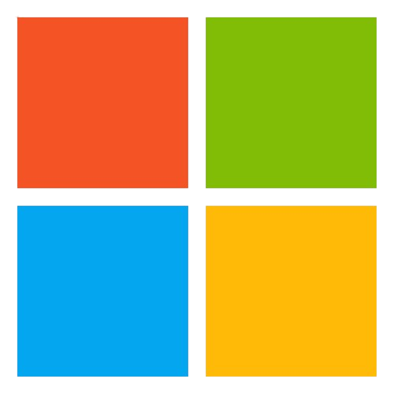
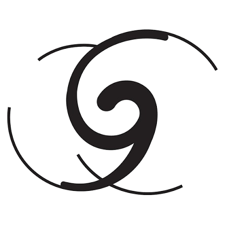
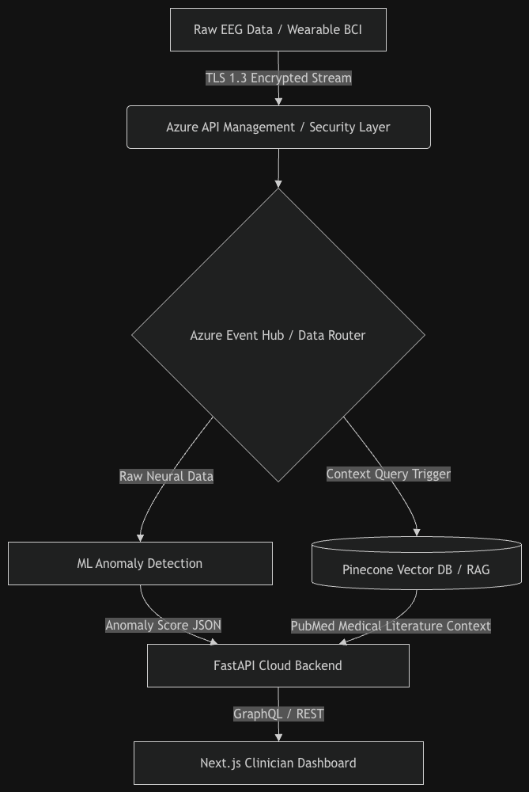
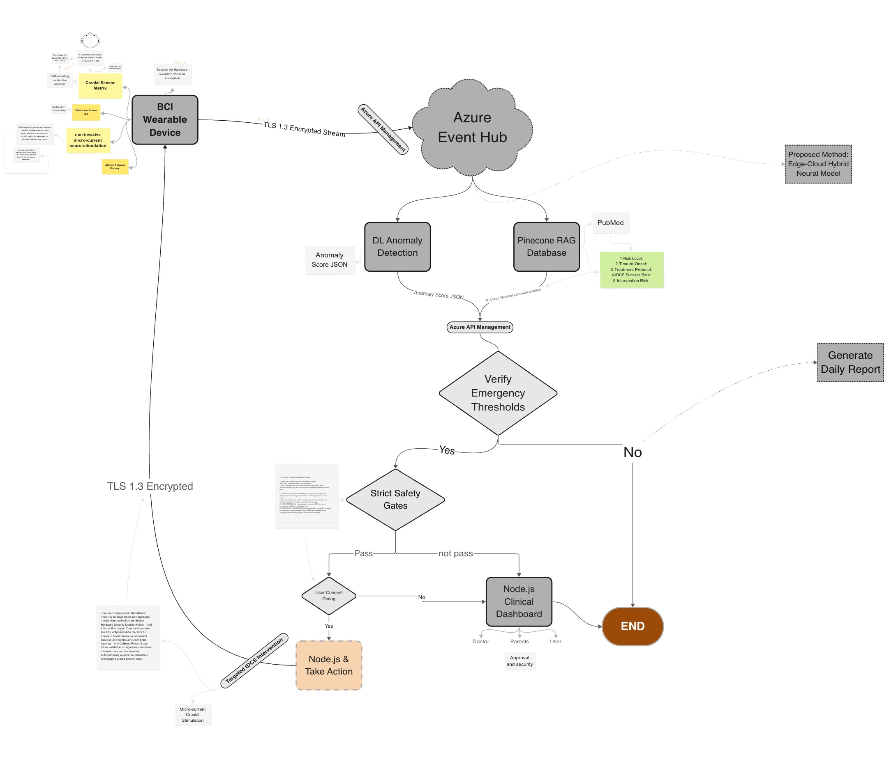

  
  &nbsp;&nbsp;&nbsp;&nbsp;&nbsp;&nbsp;
  
    
  <h1>🧠 NeuroShield 🛡️</h1>
  <h3>Proactive Neurological Care via Cloud-Backed BCI & AI</h3>
  
<strong>Developed for the New York Academy of Sciences (NYAS) Challenge</strong>

 

  
  
  

---

## 🌟 Overview

**NeuroShield** is a non-invasive Brain-Computer Interface (BCI) wearable device engineered for continuous neuro-monitoring, early anomaly detection, and closed-loop therapeutic intervention. 

Focusing on neurodegenerative diseases (Parkinson’s, Alzheimer’s), depression, stress anomalies, and acute neurological events, NeuroShield transforms raw EEG brainwave data into real-time, actionable insights. By offloading heavy processing to a highly scalable cloud architecture, it detects micro-anomalies years before physical symptoms manifest.

---

## ⚙️ How It Works (End-to-End System)

Our hybrid Edge-Cloud architecture ensures that sensitive biometric data is securely acquired, transmitted, and analyzed.

  

### 1. Hardware & Sensor Upgrades 🧠
- **Self-Hydrating Conductive Polymer Electrodes:** Maintains high signal fidelity over extended wear without the mess of wet gels or the poor clarity of dry electrodes.
- **Targeted Skull Placement:** Sensors concentrated on the frontal lobe and around the ears increase raw EEG yield from 30% to 43%.
- **Minimalist Ergonomic Casing:** Custom CAD designed and 3D printed for unobtrusive wear.

### 2. Data Security & Cloud Pipeline ☁️
- **Hardware-Level Encryption:** EEG data is secured locally using AES-256 and sent via TLS 1.3 encrypted streams.
- **Azure Event Hub & API Management:** High-throughput ingestion handles continuous streams seamlessly.
- **HIPAA Compliance:** Strict access controls and end-to-end encryption for patient privacy.

### 3. Two-Tier Anomaly Detection 🔍
- **Tier 1 (Deep Learning AI):** Real-time anomaly detection filtering noise and finding neural wave anomalies.
- **Tier 2 (Biomedical Knowledge Grounding - RAG):** Detected anomalies trigger searches in a Pinecone Vector DB (populated from PubMed and curated repositories) to cross-reference with clinical diagnostic criteria.

### 4. Safety Gates & Intervention Logic ⚡
- **Risk Thresholds:** Activated when Risk Score > 25% or Time-to-Onset < 5 minutes.
- **Consent-Driven Stimulation:** System prompts the user (or clinician via dashboard) for explicit consent before administering non-invasive microcurrent neurostimulation (tDCS).
- **Daily Summary:** Normal operations compile into a daily wellness report without autonomous stimulation.

   
  
   

---

## 💡 Key Innovations

- **Depression Focus:** A primary differentiator for this challenge. Expanding beyond neurodegenerative conditions into treatment-resistant depression.
- **Solving Stimulation-Blindness:** Advanced upstream verification ensures that the high electrical noise from microcurrent therapy doesn't needlessly blind the EEG sensors.
- **Daily Wellness Reports:** Continuous streams are processed into aggregate daily reports for baseline brain health insights.

---

## 👥 Meet the Team

| Member | Core Focus & Responsibilities |
|--------|-------------------------------|
| **Khaled** | Team Leader, Flutter Mobile App Development |
| **Nursaya** | Hardware & Electrode Research, Clinical Docs |
| **Catherine** | Deep Learning AI Model Design & Architecture |
| **Sunaina** | Cybersecurity, Backend Data Security, Cloud Safeguards |
| **Ibrahim** | 3D Modeling, CAD Casing Design, Prototyping |
| **Mustafa Kayaci** | Cloud Infrastructure, Python Dev, Web Integration |

**Mentor:** Christos Liambas

---

  <em>Project proudly submitted to the <strong>New York Academy of Sciences</strong> Challenge.</em> 
  <em>Supported by <strong>Microsoft</strong> technologies.</em>

